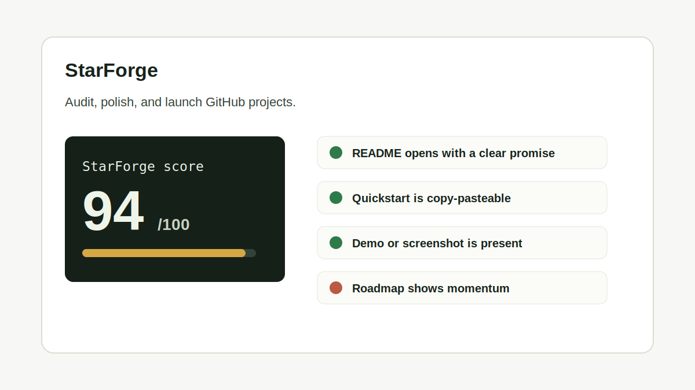
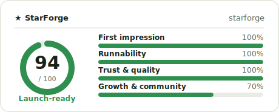

# StarForge

[](https://github.com/Wang-Yeah623/starforge/actions/workflows/ci.yml)
[](./LICENSE)
[](#embeddable-score-card)

Audit, polish, and launch GitHub projects with a practical star-readiness score.

StarForge is a small CLI and web report that checks whether a repo is easy for strangers to understand, run, trust, and share. It inspects **actual files** (LICENSE, CI workflows, tests, CONTRIBUTING), **git activity**, and **package manifests** for JavaScript, Python, Rust, and Go — then turns the gaps into a concrete, weighted checklist. No keyword guessing.



## Quickstart

```bash
npm install
npm run starforge -- --path . --checklist
npm test
```

For structured output:

```bash
npm run starforge -- --path . --json
```

## Embeddable Score Card

Run `--card` to generate an SVG scorecard (light + dark). Embed it anywhere — every embed links back to your repo, which is how the audit spreads.



```bash
npm run starforge -- --path . --card
```

StarForge prints a ready-to-paste snippet:

```md

```

### Live, auto-updating (hosted)

Deploy the bundled app to Vercel to serve a card and badge that re-audit themselves — no committed SVG to go stale:

```md
[](https://<your-app>.vercel.app/?repo=owner/name)
```

The badge uses the shields.io endpoint (URL-encode the inner address):

```md
[](https://<your-app>.vercel.app/?repo=owner/name)
```

Or open the site and paste a repo to see its live report.

## Why This Exists

Many good projects stay quiet because the first five minutes feel unfinished. StarForge scores 13 signals people actually scan before they star, clone, share, or open a pull request, grouped into four categories:

- **First impression** — a one-sentence promise under the title, a screenshot/demo, status badges
- **Runnability** — a copy-pasteable quickstart and a recognizable package manifest
- **Trust & quality** — a real LICENSE file, tests, CI config, recent commits, community-health files
- **Growth & community** — discoverable metadata, a contribution path, releases or a changelog

## CLI

```bash
starforge [--path ./repo] [--card] [--checklist] [--json]
starforge owner/name [--card] [--json]   # audit any public repo, no clone
```

Options:

| Flag | Description |
| --- | --- |
| `--path`, `-p` | Local repository path to audit |
| `--repo`, `-r` | Audit a remote repo by `owner/name` (uses `GITHUB_TOKEN` if set) |
| `--card` | Write an embeddable SVG score card (light + dark) |
| `--checklist` | Write `STARFORGE_CHECKLIST.md` into the audited repo |
| `--launch-kit` | Generate AI launch materials with your own key (BYOK) |
| `--json` | Print a structured audit report |
| `--help`, `-h` | Show usage help |

## Web Report

Run the local report UI:

```bash
npm run dev
```

Then open the Vite URL printed in your terminal. The UI shows a sample audit, scoring rules, and launch checklist patterns.

## GitHub Action

Audit every pull request and post the score as a comment:

```yaml
# .github/workflows/starforge.yml
name: StarForge
on: pull_request
permissions:
  contents: read
  pull-requests: write
jobs:
  audit:
    runs-on: ubuntu-latest
    steps:
      - uses: actions/checkout@v5
      - uses: Wang-Yeah623/starforge@main # or pin to a released tag
        with:
          fail-under: '70' # optional: block merges below 70
```

| Input | Default | Description |
| --- | --- | --- |
| `path` | `.` | Path to the repository to audit |
| `comment` | `true` | Upsert a pull-request comment with the score |
| `card` | `true` | Write `starforge-card.svg` into the workspace |
| `fail-under` | `0` | Fail the job below this score (`0` disables the gate) |

It also exposes `score` and `grade` outputs for later steps.

## AI Launch Kit

Turn the audit into launch materials — a sharper tagline, description, topics, concrete README fixes, and a "Show HN"-style post. Bring your own key (BYOK); StarForge never stores it.

```bash
export ANTHROPIC_API_KEY=...   # or OPENAI_API_KEY
starforge owner/name --launch-kit
```

Override the provider or model with `STARFORGE_AI_PROVIDER` (`anthropic` | `openai`), `STARFORGE_AI_MODEL`, and `STARFORGE_AI_BASE_URL` (for any OpenAI-compatible endpoint). On the hosted site, the **AI launch kit** panel runs entirely in your browser — the key goes straight to the provider.

## Example Output

```text
StarForge  ·  starforge (local)

  Score  94/100   Launch-ready
  Strong launch shape. 1 signal left before sharing widely.

  First impression    ██████████ 100%
  Runnability         ██████████ 100%
  Trust & quality     ██████████ 100%
  Growth & community  ███████░░░  70%

Fix next:
  • Cut a tagged release or add a CHANGELOG so people can see the project is evolving.
```

## Launch Template

Use this when you publish the repo:

```text
I built StarForge, a tiny CLI that audits whether a GitHub repo is ready for strangers.

It checks README clarity, quickstart quality, demo presence, metadata, license, test scripts, contributor path, launch copy, and roadmap, then writes a checklist.

Try it:
npm run starforge -- --path . --checklist
```

## Development

```bash
npm install
npm run lint
npm test
npm run build
```

## Deploy

[](https://vercel.com/new/clone?repository-url=https%3A%2F%2Fgithub.com%2FWang-Yeah623%2Fstarforge)

The web report and `/api/*` endpoints deploy to Vercel as-is (framework auto-detected as Vite). Optionally set a `GITHUB_TOKEN` environment variable to raise the GitHub API rate limit.

| Endpoint | Returns |
| --- | --- |
| `/api/report?repo=owner/name` | Full audit report as JSON |
| `/api/card?repo=owner/name[&theme=dark]` | Embeddable SVG score card |
| `/api/badge?repo=owner/name` | shields.io endpoint badge |

## Roadmap

- [x] Real file / git / manifest signals across JavaScript, Python, Rust, and Go
- [x] Embeddable SVG score card + Markdown badge you can drop in any README
- [x] Hosted report: paste a GitHub URL (or `starforge owner/name`) for a live scorecard
- [x] GitHub Action that comments the audit on pull requests
- [x] AI launch kit (bring-your-own-key): tagline, topics, README fixes, launch post
- [ ] Publish to npm and the GitHub Marketplace; pin the Action to a `v1` tag

## Contributing

Contributions are welcome. Good first issues include new audit rules, clearer copy, CLI ergonomics, and report UI improvements.

Please run `npm run lint`, `npm test`, and `npm run build` before opening a pull request.

## License

MIT
